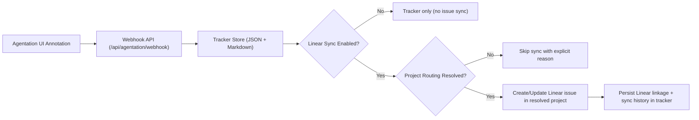
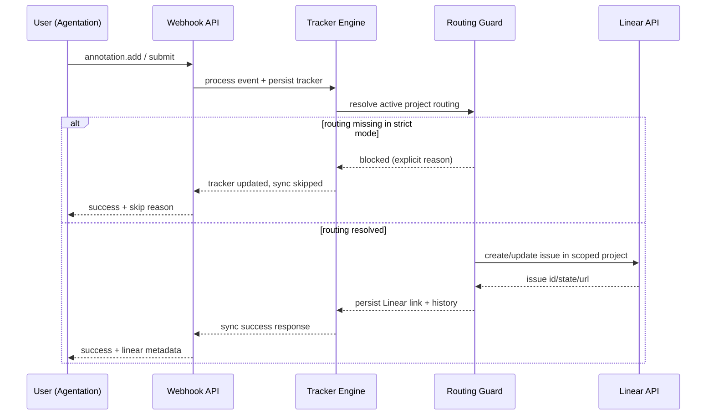

# Agentation -> Linear Automation (Project-Scoped)

Last updated: 2026-02-28

## 1) Goal

Convert UI annotations into engineering work without creating orphan or wrongly-scoped Linear issues.

This document defines a strict rule:

1. Every synced annotation must land in the dedicated Linear project for the active repository.
2. If project routing is missing or mismatched, sync must fail safe (skip), never create random issues.

## 2) Non-Technical Summary

When someone leaves UI feedback:

1. The comment is captured by webhook.
2. It is stored in a tracker file (JSON + Markdown).
3. Automation optionally syncs that comment to Linear.
4. Sync is allowed only if this repo is mapped to a specific Linear project.
5. Resolution is recorded with summary + commit SHA for auditability.

## 3) Architecture

## 4) Runtime Components

1. Webhook/API layer:
- `mcp-server/src/openaiProxy.js`
2. Tracker state machine and persistence:
- `mcp-server/src/agentationTracker.js`
3. Linear API adapter and routing guard:
- `mcp-server/src/linearSync.js`
4. Tracker artifacts:
- `docs/code reports/agentation-comments-tracker.json`
- `docs/code reports/agentation-comments-tracker.md`

## 5) Status Lifecycle

1. `pending`: fresh annotation.
2. `acknowledged`: accepted for action (auto on submit).
3. `resolved`: completed, requires evidence.
4. `dismissed`: intentionally not implemented.

Linear state mapping:

1. pending -> unstarted
2. acknowledged -> started
3. resolved -> completed
4. dismissed -> canceled (fallback completed)

## 6) Project Routing Guard (Critical)

### Inputs

1. `AGENTATION_LINEAR_PROJECT_ID` (direct repo project id).
2. `AGENTATION_LINEAR_PROJECT_MAP` (multi-repo map).
3. `AGENTATION_LINEAR_ACTIVE_PROJECT_KEY` (repo key override).
4. Repo folder name fallback from runtime cwd.

### Resolution Order

1. Use `AGENTATION_LINEAR_PROJECT_ID` if set.
2. Else resolve `projectMap[activeProjectKey]`.
3. Else:
- if `AGENTATION_LINEAR_ENFORCE_PROJECT=true`: block sync.
- if false: allow team-level sync (not recommended).

### Why this prevents random issue creation

Issue create/update does not execute when project resolution fails under strict mode. The API returns a deterministic skip reason (`linear-project-not-configured-for-active-project`) and stores sync failure context in tracker history.

## 7) Existing-Issue Scope Verification

When an annotation already links to a Linear issue:

1. Validate linked issue team equals `AGENTATION_LINEAR_TEAM_ID`.
2. Validate linked issue project equals resolved project id.
3. If mismatch, block update and record sync error.

Controlled by:

1. `AGENTATION_LINEAR_VERIFY_ISSUE_SCOPE=true` (default recommended).

## 8) Required and Optional Env

Required for sync:

1. `AGENTATION_LINEAR_ENABLED=true`
2. `LINEAR_API_KEY=<token>`
3. `AGENTATION_LINEAR_TEAM_ID=<team-id>`
4. Project routing:
- `AGENTATION_LINEAR_PROJECT_ID=<project-id>` or
- `AGENTATION_LINEAR_PROJECT_MAP` + active key

Recommended safety:

1. `AGENTATION_LINEAR_ENFORCE_PROJECT=true`
2. `AGENTATION_LINEAR_VERIFY_ISSUE_SCOPE=true`

Optional enrichment:

1. `AGENTATION_LINEAR_ASSIGNEE_ID`
2. `AGENTATION_LINEAR_LABEL_ID`
3. `LINEAR_API_URL` (default Linear GraphQL URL)

## 9) Operational Endpoints

1. `POST /api/agentation/webhook`
2. `GET /api/agentation/comments`
3. `POST /api/agentation/comments/:annotationId/resolve`
4. `POST /api/agentation/import`
5. `GET /api/agentation/overview`
6. `POST /api/agentation/sync-linear`

## 10) Sequence Diagram (One-screen)

## 11) Failure Modes and Expected Behavior

1. Missing Linear config:
- Behavior: skip sync, keep tracker authoritative.
2. Missing project routing in strict mode:
- Behavior: skip sync with explicit reason.
3. Existing issue in wrong project:
- Behavior: fail update, store `syncError`.
4. Linear API failure:
- Behavior: keep local tracker update, mark sync failure, no data loss.

## 12) Rollout Checklist

1. Set env values for team + project routing.
2. Restart `mcp-server`.
3. Confirm `GET /api/agentation/overview`:
- `enabled=true`
- `hasProjectRouting=true`
- `enforceProject=true`
4. Trigger one test annotation and verify:
- tracker entry created
- Linear issue created in correct project
5. Resolve annotation and verify:
- Linear issue moved to completed
- commit evidence persisted.

## 13) Governance Rules

1. Do not set `AGENTATION_LINEAR_ENFORCE_PROJECT=false` in shared environments.
2. Do not run without project routing in production-like usage.
3. Treat tracker JSON as source of truth; Linear is synchronized mirror.
4. Never close as resolved without summary + commit SHA.
