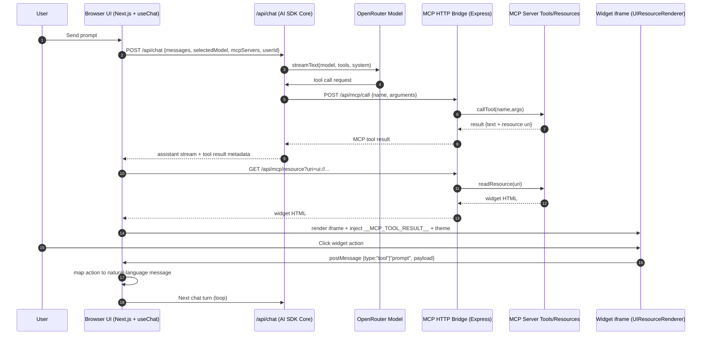
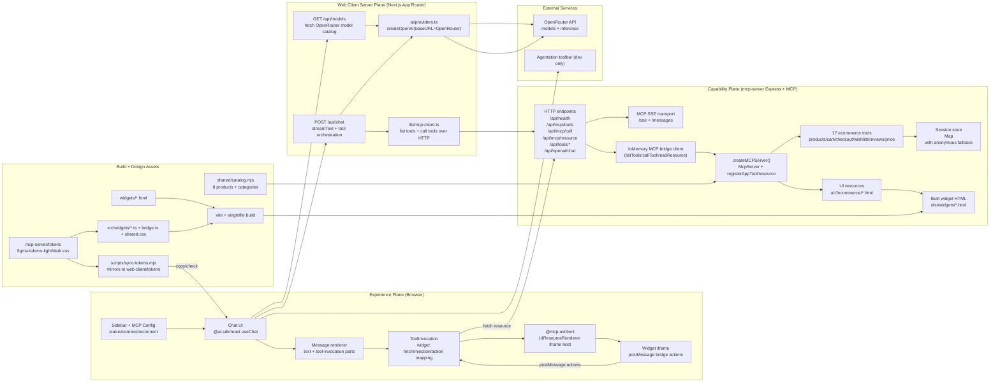

# MCP-UI-DEMO-ECOMV2 Codebase Analysis Report V2

Date: 2026-02-28
Audience: Engineering, product, design, and stakeholder walkthroughs
Scope: End-to-end solution architecture, runtime behavior, protocols, build/test workflows, operational nuances, and risk/roadmap context.

## 1) Executive Overview

This project is an interactive ecommerce assistant where a chat interface can call MCP tools and render rich widgets (product grid, cart, checkout, wishlist, reviews, pricing).

At runtime, the solution has three core planes:
- Experience plane: Next.js web client (`web-client`) with chat UI and widget iframe host.
- Intelligence/orchestration plane: Vercel AI SDK in the web client server routes (`/api/chat`, `/api/models`) using OpenRouter models.
- Capability plane: Express + MCP server (`mcp-server`) that exposes tools, resources, and widget content.

Simple mental model for non-technical readers:
- User asks in chat.
- AI decides which shopping action to run.
- MCP server runs that action and returns both data and a widget.
- Chat renders the widget and user can click inside it.
- Widget clicks loop back into chat as new intents.

## 2) What The Solution Does (Business View)

Primary user outcomes:
- Browse catalog, filter categories, search products.
- Open detailed product views.
- Add/remove cart items and see cart summary.
- Checkout and place an order.
- Manage wishlist.
- Read ratings/reviews and price snapshots.

Why this approach is useful:
- Same chat can orchestrate multiple UI components.
- Tool execution is explicit and auditable.
- Widget UI is reusable, tokenized, and independently buildable.
- MCP contract keeps capability layer separate from chat host.

## 3) Repository Structure and Responsibilities

Top-level modules:
- `web-client/`: Next.js App Router chat host, model selection, message rendering, widget renderer integration.
- `mcp-server/`: MCP tools/resources, HTTP+SSE bridge server, widget artifact serving.
- `shared/`: Shared domain dataset (`catalog.mjs`).
- `tests/`: Playwright visual/token parity checks.
- `mcp-server/tests/`: Node test runner coverage for tool flows, endpoint routes, widget action contract.
- `scripts/`: Parity tooling, token sync, and Figma/automation helpers.
- `docs/`: Reports, plans, runbooks, and parity outputs.

Current notable docs:
- V1 scan: `docs/code reports/codebase-analysis-report.md`
- Hardening plan: `docs/code reports/cleanup-hardening-plan.md`

## 4) Technology Stack (Precise)

Frontend:
- Next.js 15 App Router
- React 19
- Tailwind CSS v4
- `@mcp-ui/client` for UI resource rendering

AI/runtime SDKs in web client:
- `@ai-sdk/react`: AI SDK UI hooks (`useChat`) for chat state and streaming UX.
- `ai`: AI SDK Core runtime (`streamText`, `tool`) for orchestration and tool calling.
- `@ai-sdk/openai`: OpenAI-compatible provider adapter, configured to OpenRouter base URL.
- `@ai-sdk/anthropic`: installed dependency, not in active runtime path.

Server/capability layer:
- Express 4 + CORS middleware
- `@modelcontextprotocol/sdk` for MCP server, SSE, in-memory bridge transport
- `@modelcontextprotocol/ext-apps` for app tool/resource registration metadata
- Zod for tool schemas

Widget build:
- Vite + `vite-plugin-singlefile`
- Source in `mcp-server/widgets/*.html` and behavior in `mcp-server/src/widgets/*.ts`
- Built artifacts in `mcp-server/dist/widgets/*.html`

Canonical sources:
- Product data: `shared/catalog.mjs`
- Tokens: `mcp-server/tokens/figma-tokens-{light,dark}.css`

## 5) AI SDK Clarification (Common Confusion)

`ai` package is:
- Vercel AI SDK Core library (not a model provider).
- Used to run model streams and tool-calling orchestration.

Provider in this project:
- OpenRouter endpoint through `@ai-sdk/openai` compatibility client.
- Actual underlying model provider varies by selected model id (`openai/...`, `anthropic/...`, etc.).

Official references:
- AI SDK intro: https://ai-sdk.dev/docs/introduction
- AI SDK Core: https://ai-sdk.dev/docs/ai-sdk-core/overview
- OpenRouter quickstart: https://openrouter.ai/docs/quickstart

## 6) End-to-End Request Lifecycle (Runtime Truth)

### 6.1 User prompt path

1. User types message in chat UI (`useChat` in `web-client/components/chat.tsx`).
2. Browser submits to `POST /api/chat` (Next.js server route).
3. Route resolves selected model or default (`fetchOpenRouterModels`).
4. Route initializes available MCP tools via `initializeMCPClients(...)`.
5. `streamText(...)` runs with system prompt + tools (`maxSteps: 20`).
6. Model may call tools; tool calls are forwarded to MCP server over HTTP bridge endpoints.
7. Tool result returns text JSON plus UI resource references (`ui://...`).
8. Assistant stream returns to UI; `ToolInvocation` fetches widget HTML from MCP server.
9. Widget HTML is injected with `window.__MCP_TOOL_RESULT__` and theme marker.
10. `UIResourceRenderer` renders widget iframe.
11. Widget button clicks post actions to parent via `bridge.ts`.
12. Host maps action into natural-language user prompt and appends it back to chat.
13. Loop repeats.

### 6.2 One-screen sequence diagram

## 7) Complete Technical Architecture Diagram

## 8) Component-by-Component Deep Dive

### 8.1 Web client UI composition

`web-client/app/page.tsx`
- Two-pane app: sidebar + main chat surface.

`web-client/components/sidebar.tsx`
- MCP server controls, theme toggle, new chat.
- Reads connection status from `MCPProvider` context.

`web-client/components/chat.tsx`
- Source of truth for selected model, model details, and user id.
- Fetches `/api/models` at load.
- Uses `useChat` with body payload: `selectedModel`, selected connected MCP servers, `userId`.

`web-client/components/message.tsx`
- Renders text markdown and tool-invocation segments.
- Special compact rendering for assistant text after a widget.

`web-client/components/tool-invocation.tsx`
- Maintains widget tool allowlist (`WIDGET_TOOLS`).
- Shows per-tool skeleton UIs and status labels.
- Reads `_uiResources` and `_mcpServerUrl` from tool result.
- Fetches widget HTML, injects result payload and theme.
- Handles widget actions and maps them back into user messages.
- Provides follow-up suggestion chips per tool.

### 8.2 Model selection and provider metadata

`web-client/ai/providers.ts`
- `getLanguageModel(modelId)` builds OpenRouter client via `createOpenAI`.
- `fetchOpenRouterModels()` calls OpenRouter `/api/v1/models`, caches for 5 minutes, filters/sorts models.
- Default model fallback chain if preferred models are unavailable.

`web-client/components/textarea.tsx`
- Model picker dropdown with search + provider grouping.
- Provider logos loaded from CDN (`simple-icons`) based on model provider key.
- Icon-only provider badge style (no circular badge container).

### 8.3 MCP connectivity in frontend

`web-client/lib/context/mcp-context.tsx`
- Defines default MCP server: `http://localhost:8787/sse`.
- Probes health and tools endpoint before marking server connected.
- Tracks timing metadata and errors.
- Auto-connect behavior for default server on first visit.

Important nuance:
- Frontend does not host `/api/mcp/*` routes.
- Browser calls configured MCP server URL directly (`${baseUrl}/api/mcp/*`).

### 8.4 Chat route orchestration

`web-client/app/api/chat/route.ts`
- Resolves model from `selectedModel` or `/api/models` default.
- Initializes tool objects via `initializeMCPClients`.
- Calls `streamText` with ecommerce-specific tool policy prompt.
- Sends stream response with error mapping and cleanup hooks.

`web-client/lib/mcp-client.ts`
- Converts MCP JSON schema to zod for AI SDK `tool(...)` contracts.
- Calls `/api/mcp/tools` and `/api/mcp/call` on each configured server.
- Removes heavy `ui://` resource blobs from LLM content and keeps lightweight references.

### 8.5 MCP server capability layer

`mcp-server/src/index.js`
- Registers 12 widget resources as `ui://ecommerce/*.html`.
- Registers ecommerce tools and associates each with a widget URI where applicable.
- Reads and caches built widget files from `dist/widgets`.
- Embeds runtime tool data into widget HTML using `window.__MCP_TOOL_RESULT__`.
- Uses session-scoped in-memory store keyed by `userId`, fallback to `anonymous`.

`mcp-server/src/openaiProxy.js`
- Express app and CORS.
- Health endpoint and legacy OpenAI-compatible chat endpoint.
- MCP SSE endpoints (`/sse`, `/messages`).
- HTTP bridge endpoints (`/api/mcp/tools`, `/api/mcp/call`, `/api/mcp/resource`).
- Mutable tool protections:
  - allowlist for mutating tools,
  - optional auth token gate,
  - argument size guard,
  - optional rate limiting,
  - strict CORS mode support.

### 8.6 Widgets and host protocol

Source layout:
- Markup: `mcp-server/widgets/*.html`
- Behavior: `mcp-server/src/widgets/*.ts`
- Shared style: `mcp-server/src/widgets/shared.css`
- Communication helper: `mcp-server/src/widgets/bridge.ts`

Bridge action protocol:
- `tool`: asks host to run an MCP tool.
- `prompt`: sends user-like text prompt.
- `link`: asks host to open URL.
- `ui-size-change`: reports content dimensions for iframe auto-resize.

Design system behavior:
- Shared CSS imports token sets and uses `--sds-*` variables.
- Theme is driven via `data-theme` and live theme-change messages.

## 9) Widget Inventory and Flow Coverage

Interactive widgets:
- `product-grid`
- `product-card`
- `product-detail`
- `cart-view`
- `cart-summary`
- `wishlist`
- `search-bar`
- `category-filter`
- `checkout-form`
- `order-confirmation`

Read-only widgets:
- `price-tag`
- `review-rating`

Action mapping is contract-tested in `mcp-server/tests/widget-actions-contract.test.mjs`.

## 10) Data, State, and Session Semantics

Catalog:
- `shared/catalog.mjs` has 8 products with categories and pricing metadata.

Session state:
- `sessionStore: Map` in MCP server process.
- Per-session fields: `cart`, `wishlist`, `lastOrderId`.
- Key source: `userId` from web client localStorage (`web-client/lib/user-id.ts`).
- Fallback: `anonymous` when absent.

Operational implication:
- Session separation works only if client supplies unique `userId`.
- State is in-memory only and resets on process restart.

## 11) APIs and Contracts

Web-client server APIs:
- `GET /api/models`: model catalog from OpenRouter.
- `POST /api/chat`: stream assistant and tool calls.

MCP server APIs:
- `GET /api/health`
- `GET /api/mcp/tools`
- `POST /api/mcp/call`
- `GET /api/mcp/resource?uri=ui://...`
- `GET /sse`
- `POST /messages?sessionId=...`
- `GET /api/tools` and `POST /api/tools/:toolName` (bridge helper route family)
- `POST /api/openai/chat` (legacy optional path; OpenAI key dependent)

## 12) Build, Run, and Environment

Key commands:
- Root dev: `npm run dev`
- Server dev: `npm --prefix mcp-server run dev`
- Client dev: `npm --prefix web-client run dev`
- Widget build: `npm --prefix mcp-server run build`

Essential env:
- `web-client/.env.local`:
  - `OPENROUTER_API_KEY`
- `mcp-server/.env`:
  - `API_PORT`
  - security controls (`MCP_SECURITY_MODE`, auth/rate-limit settings)
  - optional `OPENAI_API_KEY` for legacy `/api/openai/chat`

Nuance:
- Main active inference path is OpenRouter via `web-client/api/chat`, not `mcp-server/api/openai/chat`.

## 13) Test and Quality Coverage

Server tests (`mcp-server/tests`):
- Tool flow tests (cart/checkout/wishlist).
- Route exposure test for proxy routes.
- Widget action-to-tool contract tests.

UI parity tests (`tests/visual-diff.spec.ts`):
- Snapshot tests for 12 built widget artifacts.
- Token audit for hardcoded inline hex colors.

Parity utilities:
- `scripts/capture-widgets-actual.mjs`
- `scripts/compare-widget-parity.mjs`
- `scripts/create-parity-board.mjs`

## 14) Token and Design Governance

Current governance model:
- Canonical tokens in `mcp-server/tokens`.
- Mirrored tokens in `web-client/tokens` maintained by `scripts/sync-tokens.mjs`.
- `npm run tokens:sync` and `npm run tokens:check` enforce alignment.

Tokenized widget styling:
- `mcp-server/src/widgets/shared.css` imports light/dark token files.

## 15) Security and Reliability Nuances

Current strengths:
- Mutable tool calls can be gated via allowlist/auth/rate-limits.
- Argument payload size guards on `/api/mcp/call`.
- Session state no longer globally shared across all users by default.

Current nuances to track:
- Browser directly calls MCP server bridge endpoints; network exposure rules matter.
- CORS can be permissive in local mode.
- In-memory session store is non-persistent.
- Provider logo icons rely on external CDN availability.
- Legacy `/api/openai/chat` exists and may confuse runtime ownership if not documented.

## 16) Non-Technical Explanation of “How It Is Connected”

Analogy:
- The web client is the storefront and concierge desk.
- OpenRouter is the language brain marketplace.
- MCP server is the operations room with product/cart/order tools.
- Widgets are mini interactive screens projected back into chat.

Connection chain:
- Concierge hears request.
- Brain chooses operation.
- Operations room executes and sends back data + screen.
- Storefront displays the screen.
- Customer clicks screen buttons and asks next actions.

## 17) File-Level Reference Map (High-Value Files)

Web client:
- `web-client/app/page.tsx`
- `web-client/app/layout.tsx`
- `web-client/app/api/chat/route.ts`
- `web-client/app/api/models/route.ts`
- `web-client/components/chat.tsx`
- `web-client/components/tool-invocation.tsx`
- `web-client/components/textarea.tsx`
- `web-client/lib/mcp-client.ts`
- `web-client/ai/providers.ts`
- `web-client/lib/context/mcp-context.tsx`

MCP server:
- `mcp-server/src/index.js`
- `mcp-server/src/openaiProxy.js`
- `mcp-server/src/widgets/bridge.ts`
- `mcp-server/src/widgets/shared.css`
- `mcp-server/widgets/*.html`
- `mcp-server/src/widgets/*.ts`
- `mcp-server/vite.config.ts`

Domain/design/testing:
- `shared/catalog.mjs`
- `mcp-server/tokens/figma-tokens-light.css`
- `mcp-server/tokens/figma-tokens-dark.css`
- `mcp-server/tests/*.test.mjs`
- `tests/visual-diff.spec.ts`
- `scripts/sync-tokens.mjs`

## 18) Known Gaps and Suggested Next Iteration

Documentation-level gaps to close next:
- Add a dedicated deployment topology section (localhost vs staged vs production boundary).
- Add explicit threat model table for exposed bridge endpoints.
- Add a test matrix that includes multi-user session isolation assertions.

Implementation-level opportunities:
- Introduce persistent session store adapter (Redis/postgres) for non-local environments.
- Add provider metadata headers for OpenRouter ranking/attribution where needed.
- Add browser-to-server auth story for direct `/api/mcp/*` calls in strict mode deployments.

## 19) Change Log for This V2 Report

Compared to V1 report, this V2 adds:
- Explicit AI SDK Core/UI clarification and provider ownership model.
- Runtime-accurate note that web client directly calls MCP server bridge endpoints.
- Session-scoped state behavior with fallback semantics.
- Security control details from `openaiProxy.js`.
- One-screen sequence diagram for presentation use.
- Full technical architecture diagram with clear labels and role descriptions.
- Non-technical explanation layer for stakeholder communication.

