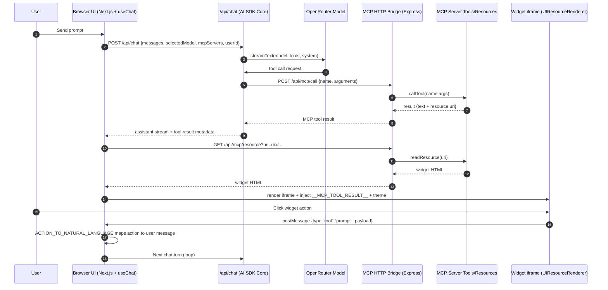
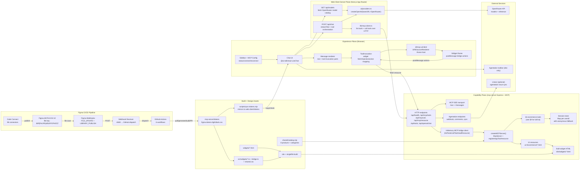
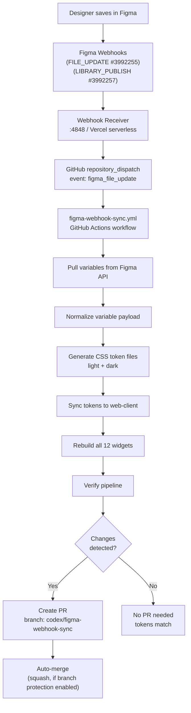

# MCP-UI-DEMO-ECOMV2 Codebase Analysis Report V3

Date: 2026-03-01
Audience: Engineering, product, design, and stakeholder walkthroughs
Scope: End-to-end solution architecture, runtime behavior, protocols, Figma-to-code automation pipeline, build/test workflows, deployment topology, operational nuances, and risk/roadmap context.

---

## Table of Contents

1. [Executive Overview](#1-executive-overview)
2. [What The Solution Does (Business View)](#2-what-the-solution-does-business-view)
3. [Repository Structure and Responsibilities](#3-repository-structure-and-responsibilities)
4. [Technology Stack (Precise)](#4-technology-stack-precise)
5. [AI SDK Clarification (Common Confusion)](#5-ai-sdk-clarification-common-confusion)
6. [End-to-End Request Lifecycle (Runtime Truth)](#6-end-to-end-request-lifecycle-runtime-truth)
7. [Complete Technical Architecture Diagram](#7-complete-technical-architecture-diagram)
8. [Component-by-Component Deep Dive](#8-component-by-component-deep-dive)
9. [MCP Tool Inventory (Complete)](#9-mcp-tool-inventory-complete)
10. [Widget Inventory and Flow Coverage](#10-widget-inventory-and-flow-coverage)
11. [Widget Action → Chat Loop Protocol](#11-widget-action--chat-loop-protocol)
12. [Data, State, and Session Semantics](#12-data-state-and-session-semantics)
13. [APIs and Contracts](#13-apis-and-contracts)
14. [Build, Run, and Environment](#14-build-run-and-environment)
15. [Figma-to-Code CI/CD Automation Pipeline](#15-figma-to-code-cicd-automation-pipeline)
16. [Code Connect (Figma Dev Mode)](#16-code-connect-figma-dev-mode)
17. [Agentation: Visual Feedback System](#17-agentation-visual-feedback-system)
18. [Test and Quality Coverage](#18-test-and-quality-coverage)
19. [Token and Design Governance](#19-token-and-design-governance)
20. [Security and Reliability](#20-security-and-reliability)
21. [Deployment Topology](#21-deployment-topology)
22. [Non-Technical Explanation](#22-non-technical-explanation)
23. [File-Level Reference Map](#23-file-level-reference-map)
24. [Environment Variable Reference](#24-environment-variable-reference)
25. [Known Gaps and Roadmap](#25-known-gaps-and-roadmap)
26. [Change Log (V2 → V3)](#26-change-log-v2--v3)

---

## 1) Executive Overview

This project is an interactive ecommerce assistant where a chat interface can call MCP tools and render rich widgets (product grid, cart, checkout, wishlist, reviews, pricing).

At runtime, the solution has three core planes:
- **Experience plane**: Next.js web client (`web-client`) with chat UI and widget iframe host.
- **Intelligence/orchestration plane**: Vercel AI SDK in the web client server routes (`/api/chat`, `/api/models`) using OpenRouter models.
- **Capability plane**: Express + MCP server (`mcp-server`) that exposes tools, resources, and widget content.

Beyond the runtime application, the project includes a complete **Figma-to-Code CI/CD automation pipeline** that keeps design tokens, CSS variables, and Code Connect mappings synchronized between Figma and code — automatically, via webhooks and GitHub Actions.

Simple mental model for non-technical readers:
- User asks in chat.
- AI decides which shopping action to run.
- MCP server runs that action and returns both data and a widget.
- Chat renders the widget and user can click inside it.
- Widget clicks loop back into chat as new intents.
- When designers change tokens in Figma, those changes automatically flow into code via webhooks + CI.

---

## 2) What The Solution Does (Business View)

Primary user outcomes:
- Browse catalog, filter categories, search products.
- Open detailed product views.
- Add/remove cart items and see cart summary.
- Checkout and place an order.
- Manage wishlist.
- Read ratings/reviews and price snapshots.

Why this approach is useful:
- Same chat can orchestrate multiple UI components.
- Tool execution is explicit and auditable.
- Widget UI is reusable, tokenized, and independently buildable.
- MCP contract keeps capability layer separate from chat host.
- Design-to-code pipeline ensures visual fidelity without manual syncing.

---

## 3) Repository Structure and Responsibilities

Top-level modules:

| Directory | Purpose |
|-----------|---------|
| `web-client/` | Next.js App Router chat host, model selection, message rendering, widget renderer integration |
| `mcp-server/` | MCP tools/resources, HTTP+SSE bridge server, widget artifact serving |
| `shared/` | Shared domain dataset (`catalog.mjs`) |
| `tests/` | Playwright visual/token parity checks |
| `mcp-server/tests/` | Node test runner coverage for tool flows, endpoint routes, widget action contract |
| `scripts/` | Parity tooling, token sync, Figma pipeline scripts, webhook management |
| `docs/` | Reports, plans, runbooks, parity outputs |
| `figma/` | Code Connect connectors, Figma config, sync config |
| `.github/workflows/` | 6 CI/CD workflows for core CI, Figma sync, webhooks |
| `tokens/` | Raw Figma variable snapshots (JSON) |
| `screenshots/` | Widget reference screenshots (base64) for parity |
| `FIGMA-TO-CODE-CICD-AUTOMATION/` | 14 automation docs + 2 consolidated playbooks |

---

## 4) Technology Stack (Precise)

### Frontend

| Technology | Version | Purpose |
|-----------|---------|---------|
| Next.js | 15 (App Router) | Chat host, API routes |
| React | 19 | Component framework |
| Tailwind CSS | v4 | Utility-first styling |
| `@mcp-ui/client` | 6.1.0 | UIResourceRenderer for widget iframes |
| `@ai-sdk/react` | 1.2.0 | `useChat` hook for chat state and streaming UX |
| `lucide-react` | 0.460 | Icon library |
| `agentation` | 2.2.1 | Visual feedback/annotation toolbar (dev) |

> Version source: `web-client/package.json`

### AI/Runtime SDKs

| Package | Role |
|---------|------|
| `ai` (4.3.0) | Vercel AI SDK Core runtime — `streamText`, `tool` |
| `@ai-sdk/openai` (1.3.0) | OpenAI-compatible provider adapter, configured to OpenRouter |
| `@ai-sdk/anthropic` (1.2.0) | Installed dependency, not in active runtime path |

### Server/Capability Layer

| Technology | Role |
|-----------|------|
| Express 4 + CORS | HTTP server for bridge endpoints and SSE |
| `@modelcontextprotocol/sdk` (1.0.0) | MCP server, SSE transport, InMemoryTransport |
| `@modelcontextprotocol/ext-apps` (1.1.2) | `registerAppTool`/`registerAppResource` registration metadata |
| Zod (4.3.6) | Tool input schema validation |

> **Note on `ext-apps`**: This package is used for `registerAppTool`/`registerAppResource` convenience wrappers only. Widget communication uses `bridge.ts` (postMessage), **not** the ext-apps `callServerTool()` function, which sends JSON-RPC messages that `UIResourceRenderer` does not understand. See agents.md for the hard rule.

### Widget Build Pipeline

| Tool | Role |
|------|------|
| Vite (6.4.1) | Build tool for widget HTML |
| `vite-plugin-singlefile` (2.3.0) | Inlines all JS/CSS into a single HTML file |

**Why single-file?** Widgets are served into sandboxed iframes. A single-file bundle eliminates CORS issues for sub-resources, ensures no external asset dependencies, and allows the MCP server to serve each widget as a self-contained HTML string via `readResource`.

### Canonical Data Sources

| Data | Source |
|------|--------|
| Product catalog | `shared/catalog.mjs` (8 products, 3 categories) |
| Design tokens (light) | `mcp-server/tokens/figma-tokens-light.css` |
| Design tokens (dark) | `mcp-server/tokens/figma-tokens-dark.css` |
| Figma raw variables | `tokens/figma/variables.raw.json` |
| Figma normalized | `tokens/figma/variables.normalized.json` |

---

## 5) AI SDK Clarification (Common Confusion)

`ai` package is:
- Vercel AI SDK Core library (not a model provider).
- Used to run model streams and tool-calling orchestration.

Provider in this project:
- OpenRouter endpoint through `@ai-sdk/openai` compatibility client.
- Actual underlying model provider varies by selected model id (`openai/...`, `anthropic/...`, etc.).

Official references:
- AI SDK intro: https://ai-sdk.dev/docs/introduction
- AI SDK Core: https://ai-sdk.dev/docs/ai-sdk-core/overview
- OpenRouter quickstart: https://openrouter.ai/docs/quickstart

---

## 6) End-to-End Request Lifecycle (Runtime Truth)

### 6.1 User prompt path

1. User types message in chat UI (`useChat` in `web-client/components/chat.tsx`).
2. Browser submits to `POST /api/chat` (Next.js server route).
3. Route resolves selected model or default (`fetchOpenRouterModels`).
4. Route initializes available MCP tools via `initializeMCPClients(...)`.
5. `streamText(...)` runs with system prompt + tools (`maxSteps: 20`).
6. Model may call tools; tool calls are forwarded to MCP server over HTTP bridge endpoints.
7. Tool result returns text JSON plus UI resource references (`ui://...`).
8. Assistant stream returns to UI; `ToolInvocation` fetches widget HTML from MCP server via `GET /api/mcp/resource?uri=ui://...`.
9. Widget HTML is injected with `window.__MCP_TOOL_RESULT__` and theme marker.
10. `UIResourceRenderer` renders widget iframe.
11. Widget button clicks post actions to parent via `bridge.ts` (`postMessage`).
12. Host maps action into natural-language user prompt via `ACTION_TO_NATURAL_LANGUAGE` and appends it back to chat.
13. Loop repeats.

### 6.2 One-screen sequence diagram



### 6.3 Widget action → chat loop detail

When a user clicks a button inside a widget iframe, the flow is:

1. **Widget TypeScript** (e.g., `product-grid.ts`) detects click on `[data-action]` element.
2. Calls `callTool(toolName, params)` from `bridge.ts`.
3. `bridge.ts` sends `window.parent.postMessage({ type: "tool", payload: { toolName, params } }, "*")`.
4. **`UIResourceRenderer`** (`@mcp-ui/client`) catches the message and forwards it to the `onUIAction` callback.
5. **`handleUiAction`** in `tool-invocation.tsx` receives the action result.
6. For `type: "tool"`: looks up `ACTION_TO_NATURAL_LANGUAGE[toolName]` to convert the tool call into a human-readable sentence (e.g., `add_to_cart({productId: 1})` → `"Add product 1 to my cart"`).
7. The natural-language message is appended to the chat via `useChat.append()`.
8. This re-enters the `/api/chat` route as a regular user message, and the LLM calls the appropriate tool.

The `ACTION_TO_NATURAL_LANGUAGE` mapping covers all 16 actionable tools:

| Widget Action | Natural Language Output |
|--------------|----------------------|
| `add_to_cart({productId: 1})` | "Add product 1 to my cart" |
| `remove_from_cart({productId: 1})` | "Remove product 1 from my cart" |
| `get_cart()` | "Show me my cart" |
| `get_cart_summary()` | "Show me my cart summary" |
| `get_products()` | "Show me the products" |
| `search_products({query: "watch"})` | "Search for \"watch\"" |
| `filter_products({category: "Footwear"})` | "Show me products in the Footwear category" |
| `get_product_detail({productId: 1})` | "Show me details for product 1" |
| `get_price_info({productId: 1})` | "What's the price of product 1?" |
| `get_categories()` | "Show me the product categories" |
| `checkout()` | "I'd like to checkout" |
| `place_order({...})` | "Place my order to ..." |
| `get_reviews({productId: 1})` | "Show me reviews for product 1" |
| `get_wishlist()` | "Show me my wishlist" |
| `add_to_wishlist({productId: 1})` | "Add product 1 to my wishlist" |
| `remove_from_wishlist({productId: 1})` | "Remove product 1 from my wishlist" |

---

## 7) Complete Technical Architecture Diagram



---

## 8) Component-by-Component Deep Dive

### 8.1 Web client UI composition

`web-client/app/page.tsx`
- Two-pane app: sidebar + main chat surface.

`web-client/components/sidebar.tsx`
- MCP server controls, theme toggle, new chat.
- Reads connection status from `MCPProvider` context.

`web-client/components/chat.tsx`
- Source of truth for selected model, model details, and user id.
- Fetches `/api/models` at load.
- Uses `useChat` with body payload: `selectedModel`, selected connected MCP servers, `userId`.

`web-client/components/message.tsx`
- Renders text markdown and tool-invocation segments.
- Special compact rendering for assistant text after a widget.

`web-client/components/tool-invocation.tsx`
- Maintains widget tool allowlist (`WIDGET_TOOLS` — 16 tools).
- Shows per-tool skeleton UIs that mirror each widget's layout (grid → 2×2 cards, detail → image+text split, cart → item rows, etc.).
- Reads `_uiResources` and `_mcpServerUrl` from tool result to fetch widget HTML via HTTP.
- Injects `injectWidgetRuntime()` with auto-resize signaling, theme broadcasting, and mutation/resize observers.
- Handles widget actions via `handleUiAction` using `ACTION_TO_NATURAL_LANGUAGE` mapping.
- Shows follow-up suggestion chips per tool (`FOLLOW_UP_SUGGESTIONS`).
- Skeleton minimum display time: 400ms to prevent flash.

### 8.2 Model selection and provider metadata

`web-client/ai/providers.ts`
- `getLanguageModel(modelId)` builds OpenRouter client via `createOpenAI`.
- `fetchOpenRouterModels()` calls OpenRouter `/api/v1/models`, caches for 5 minutes, filters/sorts models.
- Default model fallback chain if preferred models are unavailable.

`web-client/components/textarea.tsx`
- Model picker dropdown with search + provider grouping.
- Provider logos loaded from CDN (`simple-icons`) based on model provider key.

### 8.3 MCP connectivity in frontend

`web-client/lib/context/mcp-context.tsx`
- Defines default MCP server: `http://localhost:8787/sse`.
- Probes health and tools endpoint with retry logic (delays: 0ms, 300ms, 900ms) before marking server connected.
- Tracks timing metadata (latency, last check, errors).
- Auto-connect behavior for default server on first visit.

Important nuance:
- Frontend does not host `/api/mcp/*` routes.
- Browser calls configured MCP server URL directly (`${baseUrl}/api/mcp/*`).

### 8.4 Chat route orchestration

`web-client/app/api/chat/route.ts`
- Generates a `requestId` (crypto UUID) for every request — used in all error responses.
- Resolves model from `selectedModel` or `/api/models` default.
- Initializes tool objects via `initializeMCPClients`.
- Calls `streamText` with detailed ecommerce-specific system prompt including:
  - Full product catalog (8 products, IDs, prices).
  - Tool selection decision table.
  - Widget-triggered action handling rules.
  - Response format constraints (max 10 words after tool calls).
- `maxSteps: 20` allows multi-turn tool calling.
- Wrapped in try/catch with cleanup hooks on abort and finish.
- Returns `toDataStreamResponse` with error mapping.

`web-client/lib/mcp-client.ts`
- Converts MCP JSON schema to Zod for AI SDK `tool(...)` contracts.
- Strips `$schema` key from tool schemas (prevents OpenAI `strict:true` errors with optional params).
- Calls `/api/mcp/tools` to discover tools, `/api/mcp/call` to execute them.
- Separates UI resource HTML from LLM content: strips `ui://` resource blobs (can be ~371KB of HTML), keeps lightweight `_uiResources` references for the frontend to fetch separately.
- Injects `userId` into every tool call argument.

### 8.5 MCP server capability layer

`mcp-server/src/index.js`
- Registers 12 widget resources as `ui://ecommerce/*.html`.
- Registers 16 ecommerce tools, each associated with a widget URI where applicable.
- Reads and caches built widget files from `dist/widgets` with mtime-based hot-reload.
- Embeds runtime tool data into widget HTML using `<script>window.__MCP_TOOL_RESULT__=...</script>` in `<head>`.
- Uses session-scoped in-memory store keyed by `userId`, fallback to `anonymous`.
- Supports stdio transport (when `MCP_STDIO=1` or stdin is piped) and HTTP-only mode.

`mcp-server/src/openaiProxy.js`
- Express app and CORS with configurable strict mode.
- Endpoints: health, MCP bridge (tools/call/resource), SSE transport, Agentation suite, legacy OpenAI chat.
- Uses `InMemoryTransport.createLinkedPair()` for the HTTP→MCP bridge (in-process, no network).
- Mutable tool protections (see §20 Security).
- Agentation endpoints: webhook receiver, comment CRUD, Linear sync, session import, overview.

### 8.6 Widgets and host protocol

Source layout:
- Markup: `mcp-server/widgets/*.html` (12 files)
- Behavior: `mcp-server/src/widgets/*.ts` (12 files)
- Shared style: `mcp-server/src/widgets/shared.css`
- Communication helper: `mcp-server/src/widgets/bridge.ts`

Bridge action protocol (postMessage types):
- `tool`: asks host to run an MCP tool (most common, widget button clicks).
- `prompt`: sends free-form text to chat.
- `link`: asks host to open a URL in new tab.
- `ui-size-change`: reports content dimensions for iframe auto-resize.

Auto-resize implementation:
- `bridge.ts` exports `enableAutoResize()` which sets up MutationObserver + ResizeObserver + image load listeners.
- `tool-invocation.tsx` also injects `injectWidgetRuntime()` as a belt-and-suspenders approach with its own resize observer, RAF scheduling, and multi-timeout strategy (0ms, 150ms, 600ms).

Design system behavior:
- `shared.css` imports token sets (`figma-tokens-light.css`, `figma-tokens-dark.css`) and uses `--sds-*` CSS custom properties.
- Theme is driven via `data-theme` attribute on `<html>`.
- Host broadcasts `theme-change` postMessages to all widget iframes on toggle.

---

## 9) MCP Tool Inventory (Complete)

The MCP server registers exactly **16 tools** (not 17 as previously reported):

### Product Tools (6)

| Tool | Description | Widget | Mutating? |
|------|-------------|--------|-----------|
| `get_products` | Get all products in grid view | `product-grid` | No |
| `search_products(query)` | Search by name/category/keyword | `search-bar` | No |
| `filter_products(category)` | Filter by category | `category-filter` | No |
| `get_product_detail(productId)` | Detailed product view | `product-detail` | No |
| `get_price_info(productId)` | Price tag with sale/regular variants | `price-tag` | No |
| `get_categories` | List categories (text-only, no widget) | *(none)* | No |

### Cart Tools (4)

| Tool | Description | Widget | Mutating? |
|------|-------------|--------|-----------|
| `get_cart` | Show full cart | `cart-view` | No |
| `get_cart_summary` | Compact cart badge | `cart-summary` | No |
| `add_to_cart(productId)` | Add item to cart | `cart-view` | **Yes** |
| `remove_from_cart(productId)` | Remove item from cart | `cart-view` | **Yes** |

### Checkout Tools (2)

| Tool | Description | Widget | Mutating? |
|------|-------------|--------|-----------|
| `checkout` | Show checkout form | `checkout-form` | **Yes** |
| `place_order({name, email, address, ...})` | Place order, clear cart | `order-confirmation` | **Yes** |

### Wishlist Tools (3)

| Tool | Description | Widget | Mutating? |
|------|-------------|--------|-----------|
| `get_wishlist` | Show wishlist | `wishlist` | No |
| `add_to_wishlist(productId)` | Add to wishlist (deduplicates) | `wishlist` | **Yes** |
| `remove_from_wishlist(productId)` | Remove from wishlist | `wishlist` | **Yes** |

### Review Tool (1)

| Tool | Description | Widget | Mutating? |
|------|-------------|--------|-----------|
| `get_reviews(productId)` | Show reviews/ratings | `review-rating` | No |

**6 mutating tools** are subject to security controls (allowlist, auth, rate limiting): `add_to_cart`, `remove_from_cart`, `checkout`, `place_order`, `add_to_wishlist`, `remove_from_wishlist`.

**`get_categories`** is the only tool that returns text-only content with no associated widget.

---

## 10) Widget Inventory and Flow Coverage

### 12 Widgets

Interactive widgets (10):
- `product-grid` — Browse with local filter tabs, add-to-cart, view-details
- `product-card` — Single product card with add-to-cart, view-details
- `product-detail` — Full product view with size/qty selectors, add-to-cart, add-to-wishlist
- `cart-view` — Cart items with remove, checkout, continue-shopping
- `cart-summary` — Compact badge with open-cart, place-order
- `wishlist` — Saved items with move-to-cart, remove
- `search-bar` — Search input with trending tags, select product, tag search
- `category-filter` — Category tabs that trigger filter
- `checkout-form` — Address/payment form with validation, place-order
- `order-confirmation` — Order summary with continue-shopping

Read-only widgets (2):
- `price-tag` — Price display with sale/discount badge
- `review-rating` — Rating distribution and review cards

### Complete User Journey Flow

```
START → get_products (Product Grid)
  ├── Filter tab click → LOCAL filter (no server call)
  ├── Card "Add to Cart" → add_to_cart
  ├── Card "View Details" → get_product_detail
  └── Follow-up chips: "Filter by Footwear", "Search for watches"

get_product_detail (Product Detail)
  ├── "Add to Cart" → add_to_cart
  ├── "Add to Wishlist" → add_to_wishlist
  └── Follow-up chips: "Show reviews", "Check the price"

add_to_cart → Cart View
  └── Follow-up chips: "View my cart", "Continue shopping", "Proceed to checkout"

get_cart (Cart View)
  ├── "Remove" → remove_from_cart
  ├── "Checkout" → checkout
  └── "Continue Shopping" → get_products

checkout (Checkout Form)
  └── "Place Order" → place_order

place_order (Order Confirmation)
  └── "Continue Shopping" → get_products

search_products (Search Bar with results)
  ├── Select product → get_product_detail
  └── Tag search → search_products

get_wishlist (Wishlist)
  ├── "Move to Cart" → add_to_cart + remove_from_wishlist
  └── "Remove" → remove_from_wishlist
```

Action mapping is contract-tested in `mcp-server/tests/widget-actions-contract.test.mjs`.

---

## 11) Widget Action → Chat Loop Protocol

This is a critical non-obvious architectural element that makes widget interactivity work.

### The Problem
Widget iframes are sandboxed. They can't directly call MCP tools or access the chat state. There is no JSON-RPC transport between widgets and the host.

### The Solution: Natural Language Bridge
Instead of a programmatic API, widget actions are translated into natural language messages that re-enter the chat as if the user typed them. The LLM then interprets the message and calls the appropriate tool.

### Bridge Types
`bridge.ts` defines four message types:

| Type | Method | What happens |
|------|--------|-------------|
| `tool` | `callTool(name, params)` | Host looks up `ACTION_TO_NATURAL_LANGUAGE[name]` and converts to user message |
| `prompt` | `sendPrompt(text)` | Text appended as-is to chat |
| `link` | `openLink(url)` | Opens URL in new tab (no chat message) |
| `ui-size-change` | (auto) | Reports content dimensions for iframe resize |

### Why Natural Language Instead of Direct Tool Calls?
- The LLM can add context and respond conversationally.
- The system prompt enforces rules about post-tool responses.
- Error handling and multi-step flows are handled by the LLM naturally.
- No need for a second tool-calling path outside the AI SDK framework.

---

## 12) Data, State, and Session Semantics

### Catalog
- `shared/catalog.mjs` has 8 products across 3 categories (Footwear, Clothing, Accessories).
- Each product: `id`, `name`, `category`, `price`, `image` (Unsplash URL).
- Categories listed in the catalog header: `['All', 'Footwear', 'Clothing', 'Accessories']`.

### Session State
- `sessionStore: Map<string, SessionState>` in MCP server process.
- Per-session fields: `cart: Product[]`, `wishlist: Product[]`, `lastOrderId: number`.
- Key source: `userId` from web client `localStorage` (generated in `web-client/lib/user-id.ts`).
- Fallback: `anonymous` when absent or empty.

### Operational Implications
- **Single-process only**: Session state lives in a single Node.js process. Horizontal scaling (multiple server instances) will break session isolation — each instance has its own `Map`.
- **Non-persistent**: Process restart clears all carts/wishlists/orders.
- **No authentication boundary**: `userId` is client-generated (localStorage). There is no server-side session validation or token-based auth.
- **Cart item identity**: Cart items use `Date.now()` as `cartId` — theoretically allows duplicates of the same product.

---

## 13) APIs and Contracts

### Web-Client Server APIs

| Endpoint | Method | Purpose |
|----------|--------|---------|
| `/api/models` | GET | Fetch OpenRouter model catalog (5-min cache) |
| `/api/chat` | POST | Stream assistant response with tool calls |

### MCP Server APIs — Core

| Endpoint | Method | Purpose |
|----------|--------|---------|
| `/api/health` | GET | Server health + AI configuration status |
| `/api/mcp/tools` | GET | List all registered MCP tools with schemas |
| `/api/mcp/call` | POST | Execute a tool by name with arguments |
| `/api/mcp/resource` | GET | Fetch widget HTML by `uri` parameter |
| `/sse` | GET | MCP SSE transport (persistent connection) |
| `/messages?sessionId=` | POST | SSE message handler |
| `/api/tools` | GET | Bridge helper: list tools |
| `/api/tools/:toolName` | POST | Bridge helper: call tool by name |
| `/api/openai/chat` | POST | Legacy OpenAI-compatible chat (requires `OPENAI_API_KEY`) |

### MCP Server APIs — Agentation

| Endpoint | Method | Purpose |
|----------|--------|---------|
| `/api/agentation/webhook` | POST | Receive visual feedback annotations |
| `/api/agentation/comments` | GET | List annotations (filterable by status, sessionId) |
| `/api/agentation/comments/:id/resolve` | POST | Resolve an annotation |
| `/api/agentation/import` | POST | Import sessions from Agentation endpoint |
| `/api/agentation/overview` | GET | Tracker summary/overview |
| `/api/agentation/sync-linear` | POST | Sync annotations to Linear issues |

---

## 14) Build, Run, and Environment

### Key Commands

| Command | Purpose |
|---------|---------|
| `npm run dev` | Run preflight checks, then start all 3 services concurrently |
| `npm run dev:clean` | Alias for `npm run dev` |
| `npm run dev:health` | Health check all running services |
| `npm run dev:server` | Start MCP server only |
| `npm run dev:client` | Start web client only |
| `npm run dev:webhook` | Start Figma webhook receiver |
| `npm --prefix mcp-server run build` | Build all 12 widget HTML bundles |
| `npm run tokens:sync` | Mirror tokens from mcp-server → web-client |
| `npm run tokens:check` | Verify token alignment (no drift) |
| `npm run parity:run` | Build + capture + compare widget parity |
| `npm run figma:sync:local` | Full local Figma sync pipeline |
| `npm run figma:sync:pull` | Pull sync (Figma → Code) |
| `npm run figma:sync:push` | Push sync (Code → Figma) |
| `npm run figma:sync:full` | Bidirectional sync |
| `npm run webhook:manage` | CLI for managing Figma webhooks |
| `npm run webhook:test` | Test webhook delivery |

### Service Ports

| Service | Port | Description |
|---------|------|-------------|
| Web Client (Next.js) | 3000 | Chat UI, API routes |
| MCP Server (Express) | 8787 | Tools, widgets, SSE, bridge |
| Webhook Receiver | 4848 | Figma webhook → GitHub dispatch |

### Nuances
- Main active inference path is OpenRouter via `web-client/api/chat`, not `mcp-server/api/openai/chat`.
- The legacy `/api/openai/chat` endpoint requires a separate `OPENAI_API_KEY` and exists for direct OpenAI testing; it is not part of the standard flow.
- `npm run dev` runs `dev-preflight.sh` which checks dependencies, builds widgets, and validates ports before starting services.

---

## 15) Figma-to-Code CI/CD Automation Pipeline

This is a major subsystem that was absent from V2. The pipeline automates the flow of design token changes from Figma into production code.

### Architecture



### The 6 GitHub Actions Workflows

| Workflow | Trigger | Purpose |
|----------|---------|---------|
| `ci-core.yml` | Push to `main`, PRs | Core CI: install, token check, build widgets, test, build web-client, Figma verify |
| `figma-webhook-sync.yml` | `repository_dispatch` (from webhook receiver) or manual | Full automated pipeline: pull → normalize → generate → sync → build → PR → auto-merge |
| `figma-pull-variables.yml` | Daily cron (03:00 UTC) or manual | Scheduled pull to catch any missed webhook events |
| `figma-push-variables.yml` | Daily cron (04:00 UTC) or manual | Push code tokens back to Figma (dry-run by default, `apply` flag for production) |
| `figma-codeconnect-sync.yml` | Changes to connectors/widget source, or manual | Generate, verify, and optionally publish Code Connect mappings |
| `webhook-health.yml` | Daily cron (06:00 UTC) or manual | Verify webhooks are ACTIVE, alert via GitHub Issues if degraded |

### Pipeline Scripts

| Script | Purpose |
|--------|---------|
| `scripts/figma-pull-variables.mjs` | Fetch variables from Figma REST API |
| `scripts/figma-normalize-variables.mjs` | Normalize raw variable JSON into a stable format |
| `scripts/figma-generate-tokens.mjs` | Generate `figma-tokens-light.css` + `figma-tokens-dark.css` |
| `scripts/sync-tokens.mjs` | Mirror token CSS to `web-client/tokens/` |
| `scripts/figma-verify.mjs` | Verify token coverage, file existence, drift detection |
| `scripts/figma-webhook-receiver.mjs` | HTTP server that receives Figma webhooks and dispatches to GitHub |
| `scripts/figma-webhook-manage.mjs` | CLI to list/create/delete/test webhooks |
| `scripts/figma-push-variables.mjs` | Push local token changes back to Figma |
| `scripts/figma-probe.mjs` | Probe Figma API capabilities and rate limits |

### Figma Configuration

| Setting | Value |
|---------|-------|
| File key | `dbPjFeLfAFp8Sz9YGPs0CZ` |
| Team ID | `1609792196781393010` |
| Webhook: FILE_UPDATE | ID `3992255`, targets repo dispatch |
| Webhook: LIBRARY_PUBLISH | ID `3992257`, targets repo dispatch |
| Required GitHub secrets | `FIGMA_ACCESS_TOKEN`, `FIGMA_FILE_KEY`, `FIGMA_REGION` |

### Safety Mechanisms
- **Concurrency control**: `figma-webhook-sync` uses `cancel-in-progress: true` to prevent parallel sync runs.
- **File key validation**: Webhook payload `file_key` is compared against `FIGMA_FILE_KEY` secret.
- **Dry-run default**: Push workflow defaults to dry-run; requires explicit `apply: true` input.
- **Artifact retention**: All sync runs upload verification artifacts (14-day retention).
- **Health monitoring**: Daily webhook health check creates GitHub Issues on degradation.

---

## 16) Code Connect (Figma Dev Mode)

Code Connect links Figma design components to their code implementations, so developers see relevant code snippets directly in Figma's Dev Mode.

### Coverage
- **98 total connectors** published to Figma.
- **36 widget connectors**: 12 Code-Match + 12 Light + 12 Dark variants.
- **62 design system connectors**: covering DS primitives.

### Connector Structure

```
figma/code-connect/
├── components/           # Code-Match theme connectors (12)
│   ├── ProductGrid.figma.tsx
│   ├── CartView.figma.tsx
│   └── ...
├── components/light/     # Light theme connectors (12)
├── components/dark/      # Dark theme connectors (12)
├── components/ds/        # Design system connectors (62)
├── mappings.source.json  # Node ID → connector mapping
└── ...
```

### Pipeline
- Generate: `npm run figma:codeconnect:generate` → scans mappings and validates code paths.
- Verify: `npm run figma:codeconnect:verify` → checks all referenced Figma node IDs exist.
- Publish: `npm run figma:codeconnect:publish` → pushes connectors to Figma via API.
- Automated via `figma-codeconnect-sync.yml` workflow (triggers on connector or widget source changes).

---

## 17) Agentation: Visual Feedback System

[Agentation](https://agentation.dev/) is the project's visual annotation and feedback tool. It provides an in-app toolbar for capturing design feedback with exact element references.

### Integration Points

**Frontend** (`web-client`):
- `agentation` package (2.2.1) installed as a dependency.
- Toolbar mounted in the app root (dev-only).

**Backend** (`mcp-server/src/openaiProxy.js`):
- 6 REST endpoints (see §13) for webhook processing, comment CRUD, and Linear sync.
- Backed by `mcp-server/src/agentationTracker.js` for persistence.

**Tracker files**:
- `docs/code reports/agentation-comments-tracker.json` — structured annotation data.
- `docs/code reports/agentation-comments-tracker.md` — human-readable view.

### Workflow Modes
1. **Manual**: Read pending annotations, implement fixes, resolve via API.
2. **Watch/Hands Free**: Loop on incoming annotations continuously.
3. **Critic**: AI generates design critique annotations on the live page.
4. **Self-Driving**: Critique + implement + resolve in one automated loop.

### Optional Linear Integration
- Env-gated: `AGENTATION_LINEAR_ENABLED`, `LINEAR_API_KEY`, `AGENTATION_LINEAR_TEAM_ID`.
- Status mapping: `pending → unstarted`, `acknowledged → started`, `resolved → completed`, `dismissed → canceled`.
- Sync endpoint: `POST /api/agentation/sync-linear`.

### Tests
- `mcp-server/tests/agentation-tracker.test.mjs` — tracker CRUD logic.
- `mcp-server/tests/openai-proxy-routes.test.mjs` — route-level integration tests for webhook + resolve endpoints.

---

## 18) Test and Quality Coverage

### Test Matrix

| Test File | What It Tests | Assertions | Runner |
|-----------|--------------|------------|--------|
| `mcp-server/tests/tool-flows.test.mjs` | End-to-end tool execution: cart add/get/remove, checkout + place_order (clears cart, returns orderId), wishlist add (dedup) + remove | Session state correctness, data integrity, order lifecycle | Node `--test` |
| `mcp-server/tests/openai-proxy-routes.test.mjs` | HTTP route exposure: health, tools list, tool call by name. Agentation routes: webhook ingestion, comment resolution, session import | Status codes, response shapes, comment state transitions | Node `--test` |
| `mcp-server/tests/widget-actions-contract.test.mjs` | Every widget `data-action` attribute maps to a valid `callTool(toolName)` invocation in the TypeScript source | Action wiring completeness for product-grid, cart-view, checkout-form, order-confirmation, wishlist, search-bar | Node `--test` |
| `mcp-server/tests/agentation-tracker.test.mjs` | Agentation tracker CRUD logic | Annotation persistence, status transitions | Node `--test` |
| `mcp-server/tests/linear-sync-config.test.mjs` | Linear sync configuration validation | Config parsing, env var handling | Node `--test` |
| `tests/visual-diff.spec.ts` | Visual snapshot tests for all 12 widgets. Loads built HTML, injects test data, captures screenshots. Also: token audit that scans all widget `<style>` blocks for hardcoded hex colors | Pixel diff ≤2%, zero hardcoded hex in CSS property values | Playwright |

### Parity Utilities (Non-Test)

| Script | Purpose |
|--------|---------|
| `scripts/capture-widgets-actual.mjs` | Capture current widget renders to `screenshots/actual/` |
| `scripts/compare-widget-parity.mjs` | Compare reference vs actual screenshots with `pixelmatch` |
| `scripts/create-parity-board.mjs` | Generate Figma parity comparison board |

### CI Integration
- `ci-core.yml` runs: token drift check → build widgets → mcp-server tests → build web-client → Figma verify.
- Test artifacts uploaded on every CI run.

---

## 19) Token and Design Governance

### Token Flow

```
Figma Variables → Figma REST API → scripts/figma-pull-variables.mjs
  → tokens/figma/variables.raw.json
  → scripts/figma-normalize-variables.mjs
  → tokens/figma/variables.normalized.json
  → scripts/figma-generate-tokens.mjs
  → mcp-server/tokens/figma-tokens-{light,dark}.css
  → scripts/sync-tokens.mjs
  → web-client/tokens/figma-tokens-{light,dark}.css
```

### Governance Rules
- **All colors must use `var(--sds-*)` tokens** — no hardcoded hex in widget CSS.
- Enforced by: `tests/visual-diff.spec.ts` token audit test.
- `npm run tokens:check` verifies mcp-server and web-client tokens are identical.
- `ci-core.yml` runs `tokens:check` on every PR.
- Token CSS files use `--sds-color-*`, `--sds-typo-*`, `--sds-size-*`, `--sds-comp-*` namespaces.

### Dark Mode
- Dark mode tokens in `figma-tokens-dark.css` override light tokens.
- Activated by `data-theme="dark"` on the HTML root element.
- Theme toggle in sidebar broadcasts changes to all widget iframes.

---

## 20) Security and Reliability

### Current Security Controls

| Control | Implementation | Location |
|---------|---------------|----------|
| **Mutating tool allowlist** | Only 6 named tools can mutate state | `MCP_MUTATING_TOOL_ALLOWLIST` env or hardcoded default |
| **Bridge authentication** | Optional Bearer token / `x-mcp-auth` header for mutating calls | `MCP_BRIDGE_AUTH_ENABLED` + `MCP_BRIDGE_AUTH_TOKEN` |
| **Rate limiting** | Per-IP bucket, configurable window/max (default: 120 req/60s) | `MCP_RATE_LIMIT_*` env vars |
| **Argument size guard** | Max 8KB payload on `/api/mcp/call` | `MCP_MAX_ARGUMENT_BYTES` |
| **CORS control** | Permissive in local mode, strict with origin allowlist in strict mode | `MCP_SECURITY_MODE` + `MCP_ALLOWED_ORIGINS` |
| **Request ID tagging** | Every `/api/chat` response includes `requestId` for tracing | `crypto.randomUUID()` |

### Open Risks

| Risk | Impact | Mitigation Path |
|------|--------|----------------|
| Browser directly calls MCP server bridge endpoints | In production, `/api/mcp/call` is exposed to the network | Enable strict CORS + bridge auth for deployed environments |
| In-memory session store is single-process | Horizontal scaling breaks session continuity | Introduce Redis/Postgres session adapter |
| `userId` is unvalidated client-generated UUID | No server-side user identity verification | Add auth layer (JWT/session token) for non-demo deployments |
| Provider logo icons rely on external CDN | `cdn.simpleicons.org` outage breaks model picker visuals | Bundle critical icons or add fallback |
| Legacy `/api/openai/chat` exists | Could confuse runtime ownership; uses separate `OPENAI_API_KEY` | Document clearly; consider removing or gating |
| No HTTPS enforcement | Local mode uses HTTP | Enforce HTTPS in deployed environments |

---

## 21) Deployment Topology

### Local Development (Default)

```
┌─────────────────────────────────────┐
│  localhost                          │
│                                     │
│  :3000  Web Client (Next.js)        │
│         ├── /api/chat               │
│         └── /api/models             │
│                                     │
│  :8787  MCP Server (Express)        │
│         ├── /api/mcp/*              │
│         ├── /sse                    │
│         ├── /api/agentation/*       │
│         └── /api/health             │
│                                     │
│  :4848  Webhook Receiver            │
│         └── POST / (from Figma)     │
│                                     │
└─────────────────────────────────────┘
          │                    ▲
          ▼                    │
  ┌─────────────┐    ┌──────────────┐
  │  OpenRouter  │    │  Figma API   │
  │  (inference) │    │  (webhooks)  │
  └─────────────┘    └──────────────┘
```

### Production Deployment

| Component | Platform | Notes |
|-----------|----------|-------|
| Web Client | Vercel (Next.js) | Serverless, auto-scaled |
| MCP Server | Standalone Node.js / container | Needs persistent process for in-memory state |
| Webhook Receiver | Vercel serverless function or standalone | Stateless, just forwards to GitHub dispatch |
| GitHub Actions | GitHub-hosted runners | Triggered by webhooks or cron |

### Important Constraints
- MCP server cannot be serverless (in-memory session store requires persistent process).
- If deploying MCP server behind a load balancer, session affinity (sticky sessions) is required until a persistent store adapter is added.
- Webhook receiver is fully stateless and can be serverless.
- Web client is fully stateless and deploys to Vercel natively.

---

## 22) Non-Technical Explanation of "How It Is Connected"

Analogy:
- The **web client** is the storefront and concierge desk.
- **OpenRouter** is the language brain marketplace.
- **MCP server** is the operations room with product/cart/order tools.
- **Widgets** are mini interactive screens projected back into chat.
- **Figma** is the design studio where the brand look is defined.
- **GitHub Actions** is the factory line that automatically updates the store's appearance whenever the design studio makes changes.

Connection chain:
1. Concierge hears request.
2. Brain chooses operation.
3. Operations room executes and sends back data + screen.
4. Storefront displays the screen.
5. Customer clicks screen buttons and asks next actions.
6. Meanwhile, if the design studio changes a color, the factory line automatically rebuilds all screens with the new look.

---

## 23) File-Level Reference Map (High-Value Files)

### Web Client

| File | Role |
|------|------|
| `web-client/app/page.tsx` | Root page: two-pane layout (sidebar + chat) |
| `web-client/app/layout.tsx` | Root layout with providers |
| `web-client/app/api/chat/route.ts` | Chat API: model resolution, tool orchestration, streaming |
| `web-client/app/api/models/route.ts` | Model catalog from OpenRouter |
| `web-client/components/chat.tsx` | Chat UI with `useChat`, model/server management |
| `web-client/components/tool-invocation.tsx` | Widget lifecycle: skeleton → fetch → render → action mapping |
| `web-client/components/textarea.tsx` | Input + model picker with provider logos |
| `web-client/components/message.tsx` | Message renderer (markdown + tool invocations) |
| `web-client/components/sidebar.tsx` | MCP server controls, theme toggle |
| `web-client/lib/mcp-client.ts` | MCP HTTP bridge client: schema conversion, tool init, UI resource separation |
| `web-client/ai/providers.ts` | OpenRouter provider setup, model catalog with caching |
| `web-client/lib/context/mcp-context.tsx` | MCP server connection management, health probing |
| `web-client/lib/user-id.ts` | Client-side userId generation (localStorage) |

### MCP Server

| File | Role |
|------|------|
| `mcp-server/src/index.js` | MCP server factory: 16 tools, 12 resources, session store |
| `mcp-server/src/openaiProxy.js` | Express app: HTTP bridge, SSE, Agentation, security controls |
| `mcp-server/src/agentationTracker.js` | Agentation comment persistence and Linear sync |
| `mcp-server/src/widgets/bridge.ts` | Widget↔host postMessage communication |
| `mcp-server/src/widgets/shared.css` | Token-based shared styles for all widgets |
| `mcp-server/widgets/*.html` | Widget HTML source (12 files) |
| `mcp-server/src/widgets/*.ts` | Widget behavior source (12 files) |
| `mcp-server/vite.config.ts` | Vite build config for single-file widget bundling |
| `mcp-server/tokens/figma-tokens-light.css` | Light theme CSS custom properties |
| `mcp-server/tokens/figma-tokens-dark.css` | Dark theme CSS custom properties |

### Domain / Design / Testing

| File | Role |
|------|------|
| `shared/catalog.mjs` | Product catalog (8 products, 3 categories) |
| `mcp-server/tests/tool-flows.test.mjs` | Tool execution E2E tests |
| `mcp-server/tests/widget-actions-contract.test.mjs` | Widget action wiring contract tests |
| `mcp-server/tests/openai-proxy-routes.test.mjs` | Route and Agentation integration tests |
| `tests/visual-diff.spec.ts` | Visual snapshot + token audit tests |
| `scripts/sync-tokens.mjs` | Token synchronization utility |

### Figma CI/CD

| File | Role |
|------|------|
| `.github/workflows/ci-core.yml` | Core CI pipeline |
| `.github/workflows/figma-webhook-sync.yml` | Automated Figma → Code sync |
| `.github/workflows/figma-pull-variables.yml` | Scheduled variable pull |
| `.github/workflows/figma-push-variables.yml` | Code → Figma push (dry-run default) |
| `.github/workflows/figma-codeconnect-sync.yml` | Code Connect publish |
| `.github/workflows/webhook-health.yml` | Daily webhook health check |
| `scripts/figma-webhook-receiver.mjs` | Webhook HTTP receiver |
| `scripts/figma-webhook-manage.mjs` | Webhook CLI manager |
| `figma/figma.config.json` | Figma file/project configuration |
| `figma/sync.config.json` | Sync pipeline configuration |
| `figma/code-connect/mappings.source.json` | Component → Code Connect mappings |

---

## 24) Environment Variable Reference

### Web Client (`web-client/.env.local`)

| Variable | Required | Purpose |
|----------|----------|---------|
| `OPENROUTER_API_KEY` | **Yes** | OpenRouter API key for model inference |

### MCP Server (`mcp-server/.env`)

| Variable | Required | Default | Purpose |
|----------|----------|---------|---------|
| `API_PORT` | No | `8787` | HTTP server port |
| `MCP_SECURITY_MODE` | No | `local` | Security mode: `local` (permissive) or `strict` |
| `MCP_ALLOWED_ORIGINS` | No | *(empty)* | Comma-separated allowed origins (strict mode) |
| `MCP_BRIDGE_AUTH_ENABLED` | No | `false` | Enable token auth for mutating tool calls |
| `MCP_BRIDGE_AUTH_TOKEN` | No | *(empty)* | Auth token for bridge calls |
| `MCP_MUTATING_TOOL_ALLOWLIST` | No | 6 defaults | Comma-separated mutating tool names |
| `MCP_MAX_ARGUMENT_BYTES` | No | `8192` | Max tool argument payload size |
| `MCP_RATE_LIMIT_ENABLED` | No | `true` | Enable per-IP rate limiting |
| `MCP_RATE_LIMIT_WINDOW_MS` | No | `60000` | Rate limit window (ms) |
| `MCP_RATE_LIMIT_MAX_REQUESTS` | No | `120` | Max requests per window |
| `MCP_STDIO` | No | *(auto)* | Force stdio transport: `1` enable, `0` disable |
| `OPENAI_API_KEY` | No | *(empty)* | Only for legacy `/api/openai/chat` endpoint |
| `OPENAI_MODEL` | No | `gpt-4o-mini` | Model for legacy endpoint |

### Figma Pipeline (root `.env.local` or GitHub Secrets)

| Variable | Required | Purpose |
|----------|----------|---------|
| `FIGMA_ACCESS_TOKEN` | **Yes** (for Figma ops) | Figma personal access token |
| `FIGMA_FILE_KEY` | **Yes** (for Figma ops) | Figma file key (`dbPjFeLfAFp8Sz9YGPs0CZ`) |
| `FIGMA_REGION` | No | Figma API region |
| `FIGMA_WRITE_CONTEXT` | No | `ci` for GitHub Actions (enables guards) |
| `GITHUB_TOKEN` | Auto (CI) | GitHub Actions token for PR creation |

### Agentation / Linear (optional)

| Variable | Required | Purpose |
|----------|----------|---------|
| `AGENTATION_LINEAR_ENABLED` | No | Enable Linear issue sync |
| `LINEAR_API_KEY` | No | Linear API key for issue creation |
| `AGENTATION_LINEAR_TEAM_ID` | No | Linear team for issue routing |
| `AGENTATION_TRACKER_PATH` | No | Override tracker JSON path |
| `AGENTATION_TRACKER_MARKDOWN_PATH` | No | Override tracker markdown path |

---

## 25) Known Gaps and Suggested Next Iteration

### Documentation Gaps
- Add a dedicated threat model table for exposed bridge endpoints with explicit mitigation requirements per deployment tier.
- Add multi-user session isolation test matrix.

### Implementation Opportunities

| Priority | Item | Impact |
|----------|------|--------|
| High | Persistent session store adapter (Redis/Postgres) | Required for any non-local deployment |
| High | Server-side user authentication | Required for production security |
| Medium | Provider metadata headers for OpenRouter ranking/attribution | Compliance, analytics |
| Medium | Bundle critical provider logo icons | Remove external CDN dependency |
| Low | Remove or gate legacy `/api/openai/chat` endpoint | Reduce confusion, shrink attack surface |
| Low | Formalize widget loading error recovery | Currently shows empty state on fetch failure |

### Design System
- Complete visual parity fixes for lowest-scoring widgets (product-grid, category-filter, product-card, wishlist, product-detail based on parity report).
- Address remaining Code Connect gaps for Icons and Library connectors (491 generated but not publishable due to non-component Figma node IDs).

---

## 26) Change Log (V2 → V3)

This V3 report addresses the following gaps identified in V2:

| # | Gap | Resolution |
|---|-----|-----------|
| 1 | Missing Figma CI/CD pipeline | Added §15 (full pipeline architecture, 6 workflows, scripts, webhooks, safety mechanisms) |
| 2 | Missing widget build rationale | Added single-file bundling explanation in §4 and §8.6 |
| 3 | `ext-apps` listed without clarification | Added explicit note in §4 that ext-apps is used only for `registerAppTool` convenience, not for widget communication |
| 4 | Tool count wrong (claimed 17, not enumerated) | Added §9 with all 16 tools fully enumerated (name, description, widget, mutating status) |
| 5 | No Agentation documentation | Added §17 (integration points, workflow modes, Linear sync, tests) |
| 6 | Session store risk understated | Expanded §12 with single-process, non-persistent, and scaling implications |
| 7 | No deployment topology | Added §21 (local + production diagrams, platform recommendations, constraints) |
| 8 | Test coverage thin | Added §18 test matrix with per-file assertion details |
| 9 | Environment variables incomplete | Added §24 (complete env var reference across all 4 services) |
| 10 | Version drift risk | Added version pinning source notes in §4 tables |
| 11 | Missing widget action → chat loop detail | Added §6.3 and §11 (complete ACTION_TO_NATURAL_LANGUAGE mapping, architectural rationale) |
| 12 | Security controls mixed with risks | Split §20 into separate controls table and risks table |
| 13 | Missing Code Connect documentation | Added §16 (98 connectors, structure, pipeline) |
| 14 | Added Figma CI/CD to architecture diagram | Updated §7 Mermaid diagram with Figma pipeline subgraph |
| 15 | Missing follow-up chips and skeleton documentation | Expanded §8.1 with skeleton design, minimum display time, and follow-up chip behavior |
